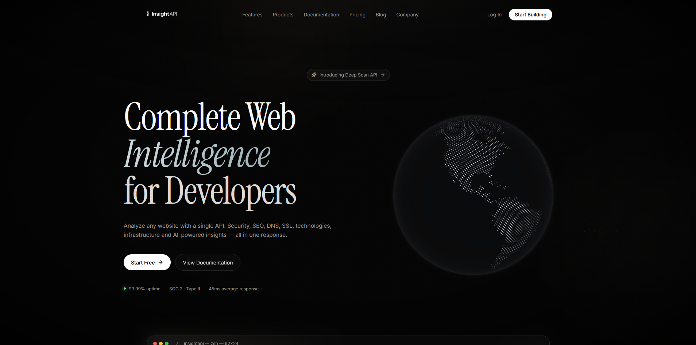
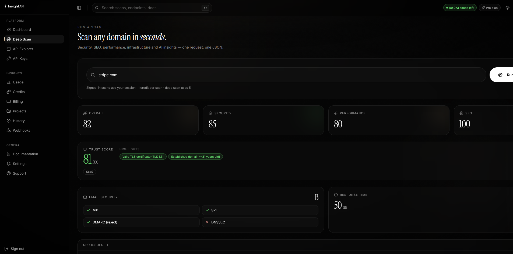
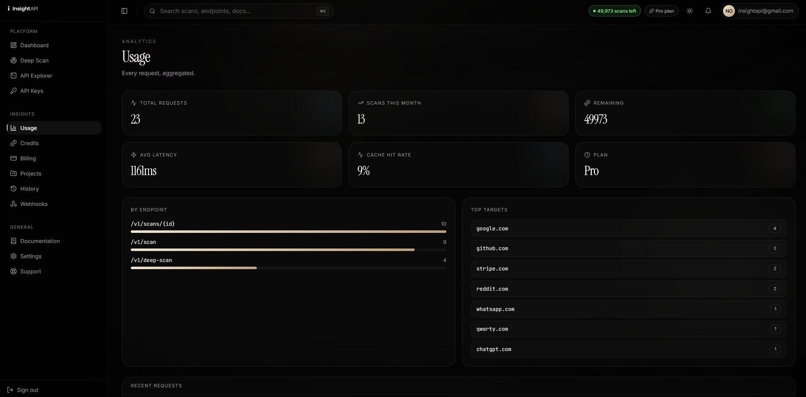

<p align="center">
  
</p>

<p align="center">
  <b>Everything about any domain — DNS, TLS, tech stack, SEO, security & trust — in a single API call.</b>
</p>

<p align="center">
  
  
  
  
  
  
</p>

<p align="center">
  <a href="https://insightapi.dev"><b>Website</b></a> ·
  <a href="#-quickstart"><b>Quickstart</b></a> ·
  <a href="#-what-you-get-back"><b>Example response</b></a> ·
  <a href="#-pricing"><b>Pricing</b></a>
</p>

---

> **Note:** This repository is a public showcase of **InsightAPI**. The source code is proprietary and **not open source** — it's here to document the product, its API, and what it can do.

## 🔎 What is InsightAPI?

InsightAPI turns a domain name into a complete intelligence report. Point it at
`example.com` and, in under two seconds, get its DNS records, WHOIS/RDAP,
TLS/certificate posture, security headers, hosting & CDN, the full technology
stack, SEO analysis with fixes, email-security grade, and an overall **trust
score** — all computed in-house, not proxied from third parties.

Built for developers, security teams, SEO tools, sales-intelligence platforms,
and anyone who needs to understand a website programmatically.

## ✨ Features

| | |
|---|---|
| 🌐 **DNS intelligence** | A/AAAA/MX/TXT/NS/CNAME/CAA/SOA, **DNSSEC**, **SPF/DMARC**, DNS provider |
| 🔐 **TLS & certificates** | Protocol, cipher, issuer, SANs, expiry countdown, validity |
| 🛡️ **Security posture** | HSTS, CSP, X-Frame-Options & more — graded A–F, plus email-security grade |
| 🧩 **Technology detection** | 80+ signatures: frameworks, backends, analytics, **payments, email, chat, hosting, CDN** |
| 📈 **SEO analysis** | Ranked `problems[]` with severity, impact & the exact **fix** — not just a score |
| 🏢 **Infrastructure** | Hosting, cloud provider, CDN, reverse DNS |
| 🧠 **Business intelligence** | **Trust score**, site category, risk flags, highlights |
| ⚡ **Fast + async** | Fast synchronous scan (<2s) and an async **deep scan** for heavy targets |
| 🔑 **Developer-first** | Clean REST, API keys, usage analytics, webhooks, per-plan rate limits |

## 🚀 Quickstart

```bash
curl -s -X POST https://api.insightapi.dev/v1/scan \
  -H "X-API-Key: isk_live_your_key" \
  -H "Content-Type: application/json" \
  -d '{"domain":"stripe.com"}'
```

<details>
<summary>JavaScript</summary>

```js
const res = await fetch("https://api.insightapi.dev/v1/scan", {
  method: "POST",
  headers: { "X-API-Key": process.env.INSIGHTAPI_KEY, "Content-Type": "application/json" },
  body: JSON.stringify({ domain: "stripe.com" }),
});
const report = await res.json();
console.log(report.scores.overall, report.intelligence.trust_score);
```
</details>

<details>
<summary>Python</summary>

```python
import requests
r = requests.post(
    "https://api.insightapi.dev/v1/scan",
    headers={"X-API-Key": "isk_live_your_key"},
    json={"domain": "stripe.com"},
)
data = r.json()
print(data["scores"]["overall"], data["intelligence"]["trust_score"])
```
</details>

## 📦 What you get back

```jsonc
{
  "schema_version": "2024-06-01",
  "target": "stripe.com",
  "duration_ms": 640,
  "dns":  { "a": ["…"], "mx": [ … ], "dnssec": { "enabled": true }, "spf": "v=spf1 …", "dmarc": "v=DMARC1; p=reject", "provider": "AWS Route 53" },
  "ssl":  { "issuer": "…", "protocol": "TLS 1.3", "days_until_expiry": 64, "valid": true },
  "security_headers": { "hsts": { "present": true }, "csp": { "present": true }, "grade": "A" },
  "email_security":  { "spf": true, "dmarc": true, "dmarc_policy": "reject", "dnssec": true, "grade": "A" },
  "technology": { "frontend": ["React"], "backend": ["Ruby on Rails"], "payments": ["Stripe"], "analytics": ["Segment"], "cdn": ["Cloudflare"] },
  "seo": {
    "title_length": 58,
    "problems": [
      { "severity": "medium", "issue": "Missing canonical tag", "impact": "Duplicate content may dilute rankings", "fix": "Add <link rel=\"canonical\">." }
    ]
  },
  "intelligence": {
    "trust_score": 96,
    "category": "SaaS",
    "risk_flags": [],
    "highlights": ["Valid TLS certificate (TLS 1.3)", "Established domain (~14 years old)"]
  },
  "scores": { "overall": 92, "security": 96, "performance": 90, "seo": 84, "infrastructure": 100, "risk": 6 }
}
```

## 🖼️ Screenshots

> _Add real screenshots here — the dashboard, a scan report, the usage analytics._

| Dashboard | Scan report | Usage & credits |
|---|---|---|
|  |  |  |

## 🧭 How it works

```
        ┌────────────┐     HTTPS      ┌────────────────────┐
Client ─┤  Your app  ├──────────────►│  InsightAPI (Go)   │
        └────────────┘   X-API-Key    │  fan-out engine    │
                                      └─────────┬──────────┘
              concurrent, per-module timeouts   │
     ┌───────────┬───────────┬─────────┬────────┴─────────┐
     ▼           ▼           ▼         ▼                  ▼
   DNS         TLS/SSL     Headers   Tech/SEO         Infra/WHOIS
     └───────────┴───────────┴─────────┴──────────────────┘
                          │ merge + score + intelligence
                          ▼
                 one versioned JSON report
```

A single request fans out to 15+ independent probes that run concurrently under a
tight latency budget, tolerate partial failure, and assemble into one coherent,
versioned JSON document. A caching layer makes popular domains near-instant; an
async job system powers the heavier **deep scan**.

## 💳 Pricing

| Plan | Price | Scans / mo | Highlights |
|---|---|---|---|
| **Free** | $0 | 100 | REST access, core modules, 3-day history |
| **Pro** | **$49/mo** · 14-day free trial | 50,000 | All modules, AI insights, webhooks, deep scan, 30-day history |
| **Business** | $249/mo | 500,000 | Higher limits, SSO, team roles, SLA 99.99% |
| **Enterprise** | Custom | Unlimited | Private regions, custom modules, dedicated CSM |

<p align="center"><a href="https://insightapi.dev"><b>Start your free trial →</b></a></p>

## 🛠️ Tech stack

**Go** core (concurrent fan-out engine) · **Supabase** auth · **PayPal**
subscriptions · **Caddy** + HTTPS · in-house fingerprint & signature databases.

## 🗺️ Roadmap

- [x] DNS · TLS · Security headers · Tech detection · SEO problems · Trust score
- [x] Accounts, API keys, usage analytics, webhooks, PayPal billing
- [ ] AI-written executive report & recommendations
- [ ] Competitor comparison
- [ ] Historical change detection (tech/SSL/DNS diffs over time)
- [ ] Screenshots & Core Web Vitals (headless render)
- [ ] Accessibility (WCAG) audit

## 📬 Contact

Questions, demos, or enterprise plans → **[insightapi.dev](https://insightapi.dev)** · `sales@insightapi.dev`

---

<p align="center"><sub>© InsightAPI. All rights reserved. Proprietary software — not licensed for redistribution.</sub></p>
